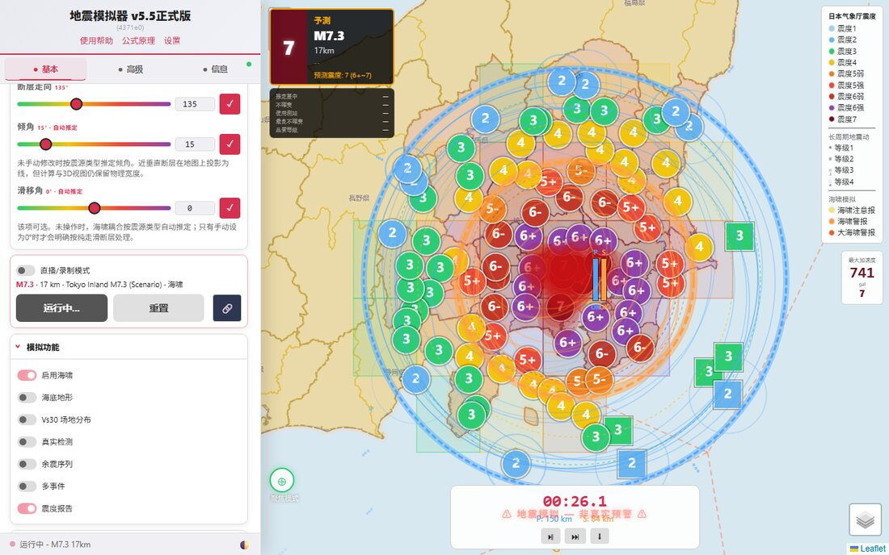
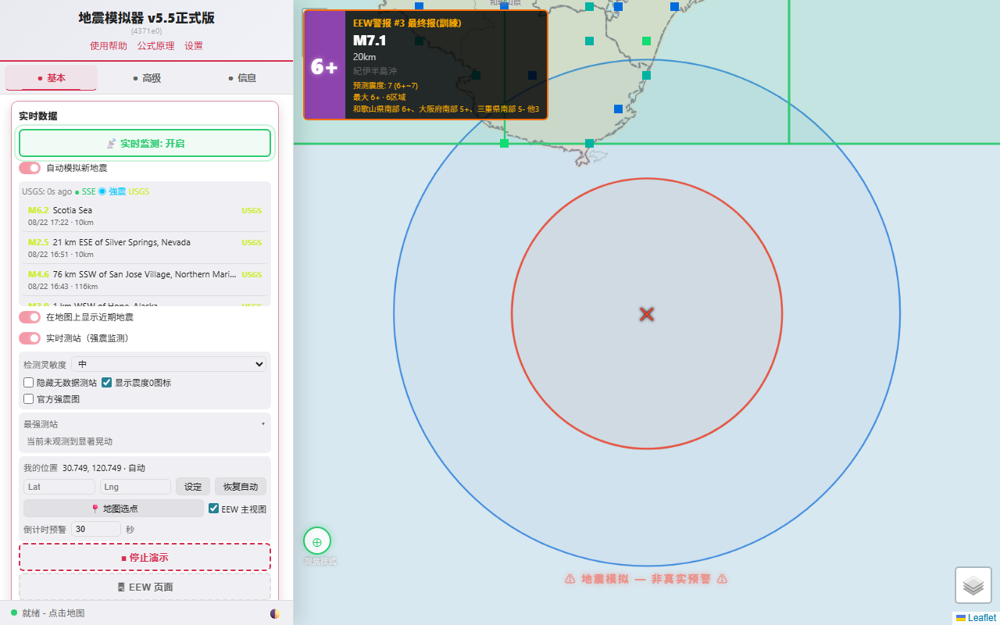
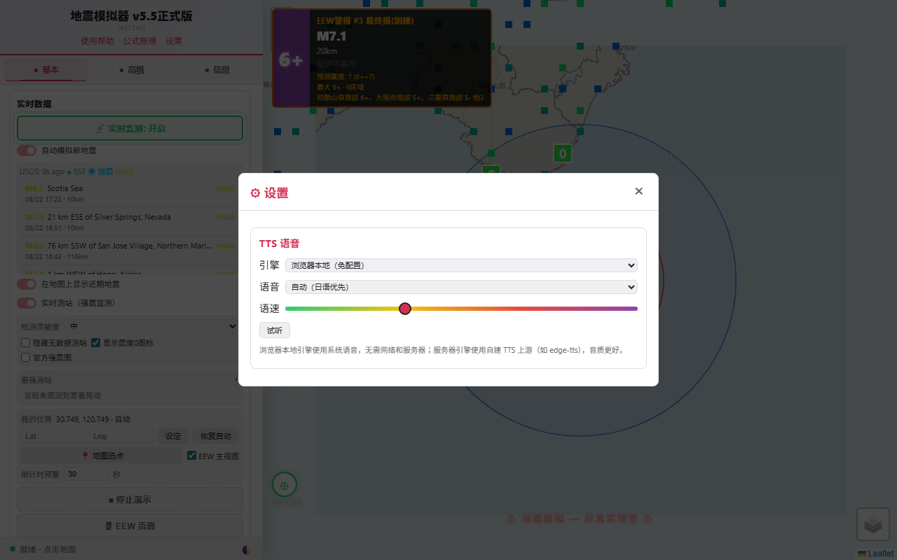

# Earthquake Simulator Pro（地震模拟器 Pro）

[](LICENSE) [](package.json) [](https://github.com/Dongwu259/open_quake_sim/actions/workflows/ci.yml) [](https://github.com/Dongwu259/open_quake_sim/releases) [](CONTRIBUTING.md)

**中文** | [English](README_EN.md)

面向日本的网页版地震模拟与实时地震监测系统。零依赖 Node.js 静态服务器 + Leaflet 前端，打开浏览器即可进行地震波传播、海啸、紧急地震速报（EEW）全流程模拟，并接入真实地震数据源进行 7×24 实时监测。

> **免责声明**：本项目为科研/教育用途的模拟软件，所有震度、海啸、EEW 结果均为模型估算，**不可用于防灾决策**。真实地震信息请以日本气象厅（JMA）等官方发布为准。

## 主要功能

**地震模拟**
- P/S 波传播、GMPE 震度预测（Zhao 2006 / Kanno 2006 / Si-Midorikawa，按震源类型自动路由 + 实测标定表）
- 有限断层模型（内置 2011 东北、2016 熊本、2024 能登等 USGS 观测模型与南海海槽 M9.0 假想模型）、Okada 地表位移
- 非线性浅水方程（NLSWE）海啸求解器（Web Worker，支持区域嵌套加密网格）、沿岸高度预报与市域淹没可视化
- 真实检测模式（不预知震中：台站触发 → 网格搜索定位 → 震级反演 → 逐报更新，类 JQuake/PLUM）
- 多事件连锁剧本（含"日本沉没"假想剧本）、余震序列（Omori-Utsu + ETAS，可手动编辑）、建筑损害与人口暴露估算
- 直播/录制模式、3D 断层可视化、TTS 语音播报（日/英/中）

**实时地震监测**
- JMA 紧急地震速报（Wolfx 中转）：P/S 波圈实时扩张、烈度预测、预警区域着色、S 波倒计时
- NIED 強震モニタ约 1700 台站实时烈度（方点显示、连锁摇动检测、最强台站排行）
- P2P 地震情报（震度速报/震源信息/各地震度/长周期地震动）与海啸情报（海岸段着色 + 到达倒计时表）
- 地震历史（USGS/EMSC 等）、服务器端 SSE 录制与时间轴回放、专属 EEW 页面、检测到事件可一键转入模拟

## 截图

| 模拟：首都直下 M7.3（EEW 预报） | 实时监测：EEW 演示 | 设置页面 |
|---|---|---|
|  |  |  |

## 快速开始

```bash
npm install
node server.js
# 打开 http://localhost:3000
```

要求 Node.js ≥ 18。前端依赖（Leaflet / turf）已随仓库本地提供，无需 CDN。

## 设置页面

侧栏底部「⚙ 设置」打开设置页面。目前提供 TTS 语音引擎选择：

- **浏览器本地**（默认）：使用操作系统自带的 Web Speech API 语音，零配置、无需网络和服务器，开箱即有语音播报；可选语音与语速。
- **服务器代理**：通过本站服务器转发到自建或云端 TTS 上游，音质更好。上游地址可在本机访问时直接在设置页修改并持久化（远端访问只读，防 SSRF），也可用 `TTS_UPSTREAM_URL` 环境变量锁定。调用云 TTS 时可填 API Key：key 只保存在本机 `settings.json`，绝不回传给任何访问者；传递方式支持 `?key=` 查询参数、`Authorization: Bearer` 与 `X-API-Key` 请求头三种。

后续更多设置项会加入同一页面。

## 可选环境变量

| 变量 | 默认 | 说明 |
|------|------|------|
| `PORT` | `3000` | 监听端口 |
| `TTS_UPSTREAM_URL` | `http://127.0.0.1:7896/tts` | TTS 语音合成上游。也可在网页「设置」页面配置（本机访问时）；env 变量优先级最高。无上游时语音播报自动静默降级，其余功能不受影响 |
| `LIVE_API_BASE` | `http://127.0.0.1:7891` | 多源地震收集器上游（`/api/live-quakes` 与目录合并）。无上游时相关列表显示"暂无数据" |
| `CORS_ORIGINS` | 关闭 | 允许跨域的来源（逗号分隔） |
| `RATELIMIT_PERSIST` | `true` | 是否持久化限流计数 |
| `PYTHON_BIN` | `python`/`python3` | `/api/waveform` 等研究接口调用的 Python 解释器 |

## 区域地形数据（可选）

高分辨率 GSI 区域 DEM（`public/geojson/gsi/*.json`）体积较大，未纳入 git。需要近岸精细地形/爬高时自行生成：

```bash
node tools/fetch-gsi-dem.js     # 下载 GSI 瓦片到 tools/data/gsi-tiles/
node tools/blend-gsi-gebco.js   # 融合生成 public/geojson/gsi/*.json
```

没有这些文件时系统自动回退到 GEBCO 全球网格。

同理，`public/geojson/vs30.json`（`python tools/build_vs30.py` 生成）与 K-NET/KiK-net 波形包（`tools/fetch-kyoshin-waveforms.js`，需 NIED 账号）也不纳入 git，缺失时对应功能自动降级或隐藏。

## 开发

```bash
npm test                          # 单元 + 集成测试
node tools/validate-release.js    # 发布校验（版本资源、PWA、i18n、数据目录）
node tools/bump-versions.js       # 修改 public/ 资产后刷新 ?v= 缓存指纹（提交前必跑）
npm run install-hooks             # 安装 pre-push 版本门禁钩子
```

静态资源采用内容哈希缓存指纹：HTML `no-cache`，JS/CSS 一年 immutable——修改 `public/` 任何文件后必须运行 `tools/bump-versions.js`，否则浏览器可能长时间使用旧缓存。

## 文档

- [docs/DEVELOPMENT.md](docs/DEVELOPMENT.md)：开发者指南（架构、目录、测试、版本指纹规则、常见配方）
- [docs/FINITE_FAULT_FORMAT.md](docs/FINITE_FAULT_FORMAT.md)：有限断层 v1 数据契约（英文）
- [docs/PHYSICS_BENCHMARKS.md](docs/PHYSICS_BENCHMARKS.md)：物理参考与数值基准

## Docker

```bash
docker-compose up -d
```

## 数据来源与致谢

- 台站数据：NIED Hi-net / F-net / 強震モニタ（防災科学技術研究所）
- 地震信息：気象庁（JMA）、P2P 地震情報、Wolfx API、USGS、EMSC
- 断层模型：USGS NEIC（Hayes 2017/2018、Goldberg 2022/2024 等，公有领域）
- 地形/海深：GEBCO 2025、地理院（GSI）DEM、Natural Earth
- 地图库：Leaflet、Turf.js

## English

The full English README lives at [README_EN.md](README_EN.md).

## License

[MIT](LICENSE) © 2026 Dongwu259
