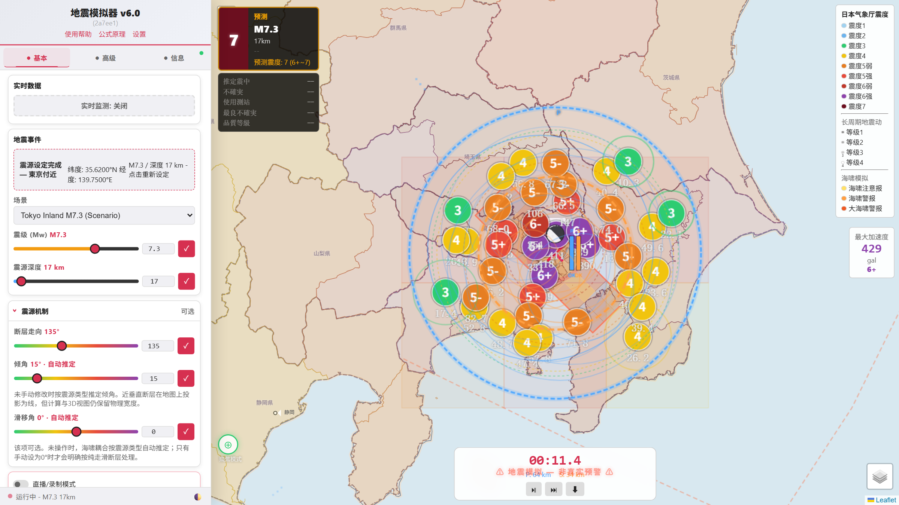

# Earthquake Simulator Pro

[](LICENSE) [](package.json) [](https://github.com/Dongwu259/open_quake_sim/actions/workflows/ci.yml) [](https://github.com/Dongwu259/open_quake_sim/releases) [](https://www.npmjs.com/package/open_quake_sim) [](https://dwfileshare.top) [](CONTRIBUTING.md)

[中文文档](README.md) | **English**

A web-based earthquake simulation and real-time monitoring app for Japan. A zero-dependency Node.js static server plus a Leaflet frontend — open your browser to simulate seismic-wave propagation, tsunamis and the full JMA earthquake early warning (EEW) lifecycle, or connect to live data sources for 24/7 monitoring.

> **Disclaimer**: This is a research/education simulator. Every intensity, tsunami and EEW result is a model estimate — **never use it for disaster-prevention decisions**. For real earthquakes, follow official announcements from the Japan Meteorological Agency (JMA) and your local authorities.

## Features

**Simulation**
- P/S wave propagation with GMPE intensity prediction (Zhao 2006 / Kanno 2006 / Si-Midorikawa, auto-routed by source type, with a calibration table fitted to observed stations)
- Finite-fault models (bundled USGS observed models — 2011 Tohoku, 2016 Kumamoto, 2024 Noto, and more — plus a synthetic Nankai Trough M9.0 scenario), Okada surface displacement
- NLSWE tsunami solver in a Web Worker (nested AMR grids supported), coastal height forecasts and city-scale inundation visualization
- Realistic detection mode (no prior epicenter: station triggering → grid-search location → magnitude inversion → report-by-report updates, JQuake/PLUM-style)
- Multi-event chained scenarios (incl. a hypothetical "Japan Sinks" sequence), aftershock sequences (Omori-Utsu + ETAS, manually editable), building-damage and population-exposure estimates
- Presenter (live/recording) mode, 3D fault visualization, TTS voice announcements (ja/en/zh)

**Real-time monitoring**
- JMA EEW (via Wolfx): live P/S wave rings, intensity forecast, warning-area coloring, S-wave countdown
- NIED Kmoni (~1,700 stations) realtime intensity (square markers, chain-activation detection, top-station ranking)
- P2P earthquake bulletins (Shindo/hypocenter/per-point/long-period) and tsunami information (coastline coloring + arrival countdown table)
- Earthquake history (USGS/EMSC and more), server-side SSE recording with a timeline replay, a dedicated EEW page, and one-click transfer of a real event into a simulation

## Screenshots

| Simulation: Tokyo Inland M7.3 (subdivision intensity forecast) | Realtime monitor: EEW demo | Settings page |
|---|---|---|
|  |  |  |

## Quick Start

Via the npm package (easiest):

```bash
npx open_quake_sim
# or install globally: npm install -g open_quake_sim && quake-sim
# open http://localhost:3000
```

From source:

```bash
git clone https://github.com/Dongwu259/open_quake_sim.git
cd open_quake_sim
npm install
node server.js
# open http://localhost:3000
```

Requires Node.js ≥ 18. Frontend dependencies (Leaflet / turf) are bundled locally — no CDN needed.

## Settings Page

Open **⚙ Settings** at the bottom of the sidebar. It currently provides the TTS voice engine picker:

- **Browser built-in** (default): speaks with the OS Web Speech API — zero configuration, no network, no server. Voice and rate selectable.
- **Server proxy**: forwards through this server to a self-hosted or cloud TTS upstream for higher-quality neural voices. The upstream URL can be edited from the local machine and is persisted (read-only for remote visitors — SSRF guard), or locked with the `TTS_UPSTREAM_URL` env var. For cloud TTS, an API key can be set: it is stored only in the local `settings.json` and never returned to any client; `?key=` query, `Authorization: Bearer` and `X-API-Key` header placements are supported.

More options will join this page over time.

## Environment Variables

| Variable | Default | Description |
|----------|---------|-------------|
| `PORT` | `3000` | Listen port |
| `TTS_UPSTREAM_URL` | `http://127.0.0.1:7896/tts` | TTS synthesis upstream. Highest priority over the settings page. Voice announcements degrade silently when no upstream is available |
| `LIVE_API_BASE` | `http://127.0.0.1:7891` | Multi-source earthquake collector upstream (`/api/live-quakes` and catalog merge). Related lists show "no data" when absent |
| `CORS_ORIGINS` | off | Allowed cross-origin sites (comma-separated) |
| `RATELIMIT_PERSIST` | `true` | Persist rate-limit counters |
| `PYTHON_BIN` | `python`/`python3` | Python interpreter used by research endpoints such as `/api/waveform` |

## Regional Terrain Data (optional)

The high-resolution GSI regional DEMs (`public/geojson/gsi/*.json`) are large and not tracked by git. Regenerate them when you need detailed nearshore terrain / run-up:

```bash
node tools/fetch-gsi-dem.js     # downloads GSI tiles into tools/data/gsi-tiles/
node tools/blend-gsi-gebco.js   # blends them into public/geojson/gsi/*.json
```

Without these files the system falls back to the GEBCO global grid automatically.

Likewise, `public/geojson/vs30.json` (generated by `python tools/build_vs30.py`) and the K-NET/KiK-net waveform packages (`tools/fetch-kyoshin-waveforms.js`, requires a NIED account) are not tracked; the corresponding features degrade or hide automatically when absent.

## Development

```bash
npm test                          # unit + integration tests
node tools/validate-release.js    # release checks (versioned assets, PWA, i18n, data catalogs)
node tools/bump-versions.js       # refresh ?v= cache fingerprints after editing public/ (required)
npm run install-hooks             # install the pre-push version gate
```

Static assets use content-hash cache fingerprints: HTML is `no-cache`, JS/CSS is one-year immutable — after editing anything under `public/`, you **must** run `tools/bump-versions.js`, or browsers may keep stale code for a long time.

More docs: [docs/DEVELOPMENT.md](docs/DEVELOPMENT.md) (developer guide, Chinese), [docs/FAQ.md](docs/FAQ.md) (FAQ, Chinese), [docs/FINITE_FAULT_FORMAT.md](docs/FINITE_FAULT_FORMAT.md) (finite-fault v1 data contract), [docs/PHYSICS_BENCHMARKS.md](docs/PHYSICS_BENCHMARKS.md) (physics reference benchmarks, Chinese).

## Docker

```bash
docker-compose up -d
```

## Data Sources & Credits

The research-grade improvements are built on observation data, benchmark cases and geographic data from the following institutions and projects. Everything shipped in this repository is a **derived quantity** of the originals (grids / statistical summaries / scorecards); fetch tooling lives in `tools/`, and account-gated datasets (NIED waveform packages, raw PS-logs) are deliberately not committed.

- **NIED** (National Research Institute for Earth Science and Disaster Resilience, Japan): Hi-net / F-net networks (1,289 stations — simulation station coverage); K-NET / KiK-net strong-motion station peaks (6 events, 2,626 stations, via USGS ShakeMap — GMPE calibration & scorecards); KiK-net surface/borehole spectral-ratio derived quantities (197 stations, DOI [10.17598/NIED.0004](https://doi.org/10.17598/NIED.0004) — empirical f0 prior for 1D site response); Kmoni strong-motion monitor (~1,700 realtime intensity stations, server-proxied); J-SHIS Vs30 (site-effect grid); JIVSM V4 velocity model (engineering-bedrock depth / travel times / long-period basin term)
- **JMA** (Japan Meteorological Agency): official seismic-intensity subdivision GIS (194 areas), EEW area names (188), tsunami forecast-coastline segments, historical observed intensities, official long-period ground-motion class thresholds (5/15/50/100 cm/s)
- **USGS NEIC**: finite-fault slip models (Hayes 2014/2017/2018, Goldberg 2022/2024, public domain), earthquake catalogs, ShakeMap
- **GEBCO**: GEBCO 2025 global bathymetry (incl. Seabed 2030 contributions) — tsunami solver terrain
- **Natural Earth**: 1:50m coastline (public domain)
- **GSI** (Geospatial Information Authority of Japan): regional high-resolution DEM (optional, generated via `tools/fetch-gsi-dem.js`) — nearshore tsunami runup
- **Cabinet Office / Headquarters for Earthquake Research Promotion, Japan**: Nankai Trough megaquake scenario (2012 framework) — the M9.0 scenario preset
- **SCEC**: official TPV5 dynamic-rupture benchmark parameters (strike.scec.org/cvws) — dynamic-rupture solver verification
- **NISEE (UC Berkeley EERC) / EERA (Univ. of Memphis; Bardet et al.)**: the SHAKE-91/EERA manual 10-layer nonlinear case and the DIAM.ACC record (1989 Loma Prieta, Diamond Heights station) — external 1D site-response benchmark
- **Realtime feeds**: Wolfx API, P2P Earthquake Information (P2P地震情報), USGS / EMSC catalogs (Yahoo Japan as a Kmoni mirror fallback)

Mapping libraries: Leaflet, Turf.js. Model references (GMPE / site response / dynamic rupture) are cited item by item in [docs/PHYSICS_BENCHMARKS.md](docs/PHYSICS_BENCHMARKS.md) and [docs/METHODS.md](docs/METHODS.md).

## License

[MIT](LICENSE) © 2026 Dongwu259
